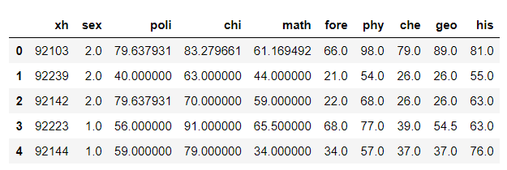
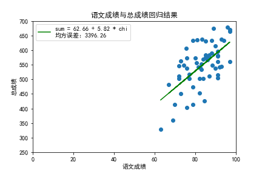
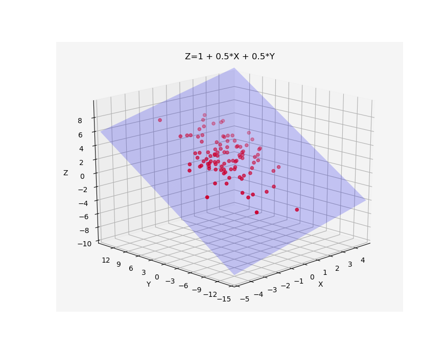
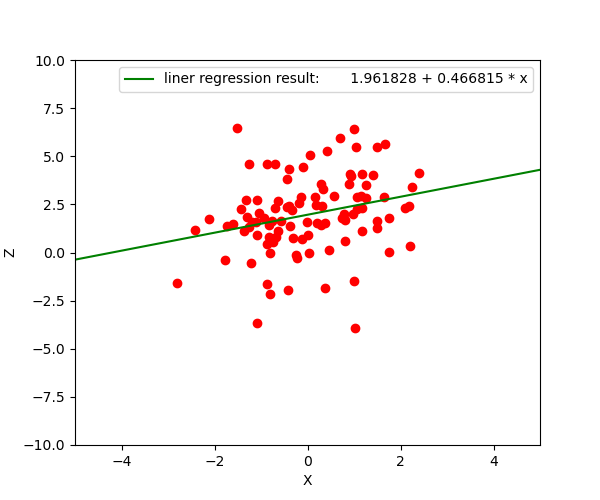

>&emsp;&emsp;陈希孺先生在《数理统计学简史》的序言中提到，数理统计学是“收集和分析数据的科学与艺术”，并且着重强调了数理统计的艺术性，指出“统计方法要灵活使用”。而灵活使用统计方法的前提，是要深入理解和掌握方法，事实上，即便是最基本的模型也大有门道，在这里把自己的一些思考写下来。

# 1.  线性回归的提出
&emsp;&emsp;“回归”一词是弗朗西斯·高尔登对父母身高和子女身高关系的研究中提出的。彼时基因已经被发现，并且人们已经认识到基因对个体性状的显著影响。基于这样的认识，高尔登一开始认为子女身高的分布应与其父母身高的分布不同。但调查结果却并非如此，反而显示子女身高与父母身高近似遵循同一正态分布。但是根据拉普拉斯中心极限定理，正态分布是“大量微小因素共同作用”的结果，而遗传对子女身高而言并非“微小因素”，这就产生了矛盾。

&emsp;&emsp;在研究这一问题的过程中，高尔登发现正态分布可以是若干个较小的正态分布的叠加，并且子女的身高有向总体身高平均值移动的趋势，即回归现象，因此解决了子女与父母身高分布同一的问题。

&emsp;&emsp;在上述回归现象中研究的对象是完全同质的，即均为身高。在数理统计学之后的发展中，研究的对象扩展到非同质的相关变量，如身高与体重、肘长与身高等，也由此发明了相关系数的概念。

&emsp;&emsp;借助回归和相关，线性回归得以初步建立，并发展成为多元线性回归，至今仍是诸多领域中十分有效的分析工具。但是许多使用者对于线性回归的认识与理解不够，要么得出经不起推敲的结论，要么进行的直接是无意义的回归。下面给出一个线性回归的实例，以指出一些值得注意的点。
# 2.  一个实例
&emsp;&emsp;现有某一班级全体学生期末各科成绩的数据，部分数据如下：

&emsp;&emsp;将总成绩作为预测变量，将语文成绩作为响应变量，进行一元线性回归，得到如下结果：

&emsp;&emsp;得到回归方程：

$$
sum = 62.657428+5.818403*chi
\tag{1.1}
\label{eq:1.1}
$$

&emsp;&emsp;对于该回归模型，可以这样理解：

$$总成绩=语文成绩可以解释的部分+语文成绩无法解释的部分$$

&emsp;&emsp;由于总成绩中包含语文成绩，故上式的“语文成绩可以解释的部分”包括语文成绩本身。此外，由于语文成绩与其他科目成绩有相关关系（直觉上是自然的，因为语文成绩好的学生其他科目成绩也会比较高），因此其他科目的成绩在一定程度上可以用语文成绩来预测。如果可行，则“语文成绩可以解释的部分”还将包括“其他科目成绩中与语文成绩相关的部分”。事实上，将语文成绩作为因变量，依次将其他科目成绩作为自变量进行一元线性回归，得到如下结果：

$$
\left \{ 
\begin{aligned}
0.000000+1.000000*chi&=chi \\ 
7.891668+0.639746*chi&=math \\ 
-20.858168+0.849845*chi&=fore\\
18.876242+0.676321*chi&=phy\\
-0.393098+0.654138*chi&=che\\
-17.761301+0.996678*chi&=geo\\
29.830859+0.586608*chi&=his
\end{aligned}
\right. 
$$

&emsp;&emsp;将上述各式相加后等号左侧为：$$62.657428+5.818403*chi$$。对比\eqref{eq:1.1}，发现两式系数完全相同。此外，对上述每个回归方程均可以做如下理解：

$$某科成绩=与语文成绩有关的部分+与语文成绩无关的部分$$

&emsp;&emsp;其中，“语文成绩可以解释的部分”指语文成绩与该科成绩的相关关系，“语文成绩无法解释的部分”则指其他未考虑因素的期望值影响的部分与随机误差。下面对后一句进行进一步的解释。

# 3.  进一步解释

&emsp;&emsp;为了说明后一句，我们进行如下的模拟实验：设随机变量$$X\sim N(0,1),Y\sim N(2,4)$$，$$X$$与$$Y$$相互独立。设随机变量$$Z=1+0.5*X+0.5*Y$$,易知$$Z\sim N(2,\frac{5}{4})$$，并且有

$$Cov(Z,X)=Cov(Z,Y)=\frac{1}{2}$$

$$\rho_{xz}=\frac{\sqrt5}{5}$$&emsp;&emsp;$$\rho_{yz}=\frac{\sqrt5}{10}$$

&emsp;&emsp;现假设，$$Z$$变量为实际要预测的变量，变量$$X$$为实际能测得的自变量，变量$$Y$$由于某种原因（如技术手段不足）在实际中无法测得。进行一次随机抽样得到容量为$$100$$的样本，这些样本对应$$Y$$值均值为$$1.921858$$。

&emsp;&emsp;要预测变量$$Z$$的变化情况，但实际中变量$$Y$$的值无法测得，故仅根据变量$$X$$对进行一元线性回归，结果如下：

&emsp;&emsp;实际回归方程：

\begin{equation}
Z=1.961828+0.466815*X
\tag{3.1}
\label{eq:3.1}
\end{equation}

&emsp;&emsp;发现回归方程中常数项与$$Z$$的实际方程中常数项差距较大，而回归系数与实际方程中$$X$$的系数相近。同时发现，将样本对应$$Y$$值均值代入实际方程中后，得到：

\begin{equation}
Z=1.960929+0.500000*X
\tag{3.2}
\label{eq:3.2}
\end{equation}

可以发现\eqref{eq:3.1}与\eqref{eq:3.2}式十分相近。

&emsp;&emsp;为了解释这一现象，我们需要考虑回归的数学定义。Z关于X的回归本质为$$E(Z|X)$$，是$$Z$$关于$$X$$的条件期望。对于上述问题，每取定一个$$X_0$$，$$Z$$的值并不是确定的，因为还要受$$Y$$的影响。由于$$Y\sim N(2,4)$$，故此时$$Z\sim N(1+0.5*2+0.5*X_0,1)$$，因而$$E(Z|X_0)=2+0.5*X_0$$。由于$$X_0$$的任意性，故理论回归方程应为：

$$E(Z|X)=2+0.5*Y$$

考虑Y服从一般分布，则理论回归方程变为：

$$E(Z|X)=1+0.5*E(Y)+0.5*X$$

&emsp;&emsp;其中即为“其他未考虑因素的期望值”，常数项可以视为服从值为1的退化分布的随机变量，同样符合。另外，可以发现理论得到的回归方程与实际抽样得到的回归方程仍有差别，这是由于抽样误差导致，也即“随机误差”（实际上的随机误差还可能包括数据收集过程中的误差等）。“其他未考虑因素的期望值”会影响实际回归方程的常数项，而“随机误差”则会影响实际回归方程中的所有系数。至此也就完整解释了一元线性回归方程的意义。